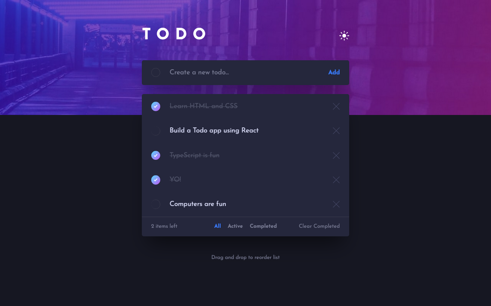

# Todo App Solution

This is a solution to the [Todo app challenge on Frontend Mentor](https://www.frontendmentor.io/challenges/todo-app-Su1_KokOW). Frontend Mentor challenges help you improve your coding skills by building realistic projects.

## About the Project

This project provides a functional and stylish todo list application, showcasing how React components can interact with Redux to manage todo items' state, including adding, completing, and removing tasks.

## Preview and Links

<b>Open Preview</b>

 

 

| [Live Demo URL](https://ionstici.github.io/todo-app-fem) | [Frontend Mentor](https://www.frontendmentor.io/solutions/todo-app-85I880nzjx) |
| -------------------------------------------------------- | ------------------------------------------------------------------------------ |

## Features

- **Task Management:** Users can add, mark as complete, and delete todo items.
- **State Management with Redux:** Efficiently manages the state of todo items across the app.
- **Responsive Design:** Ensures usability across various devices with SCSS.
- **Thematic Styling:** SCSS allows for easy theming and styling of the todo list.

## Tech Stack

- **React:** For creating the component-based structure of the todo app.
- **create-react-app:** To initialize the React project with best practices.
- **Redux:** To handle the application state, managing todo items.
- **SCSS:** For styling, providing nested rules, variables, and mixins.

## Deployment

This project is hosted on **GitHub Pages**.
